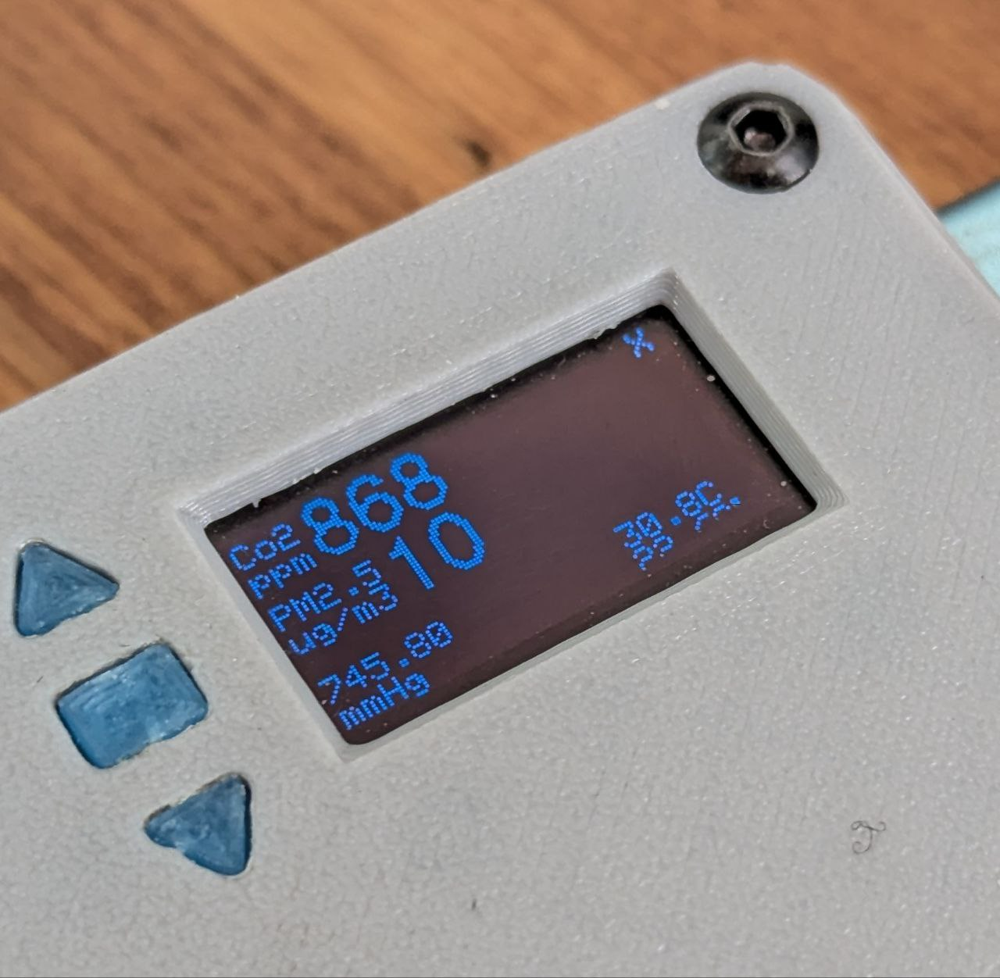
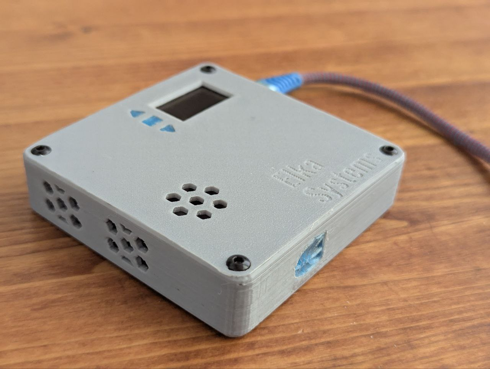

another one pet project.
#### Features
1. сollect info about Co2 ppm,PM1-PM10,temp,humidity,pressure
2. display info on the screen 
3. send out info with  BLE , possible future HomeAssistant support
4. consume elictricity 
### How does it look?

#### Used components
4. Lolin32 Lite
5. SCD30
6. PMSA003
7. BMP180
8. SSD1306
9. Random mouse buttons
10. M2+M3 screws
11. M3 heated inserts
#### Used tools
1. 3d Printer
2. Solider iron
3. Orca Slicer
4. Fusion 360
5. brain?(goofy ahh 3 braincells airflow design (there was no airflow design))
6. Vscode+Platformio
#### How to build
1. Download vscode
2. Install platformio extension
3. Clone this repo
4. Open folder with platformio
5. Click build
6. Assemble device (it's easy to figure it out)
7. Flash with platformio, in case of failure decrease baudrate

L\_Z4 OCG FLASHBACK ( i hate writing guides )
i won't maintain this code  unless i will (lazy)